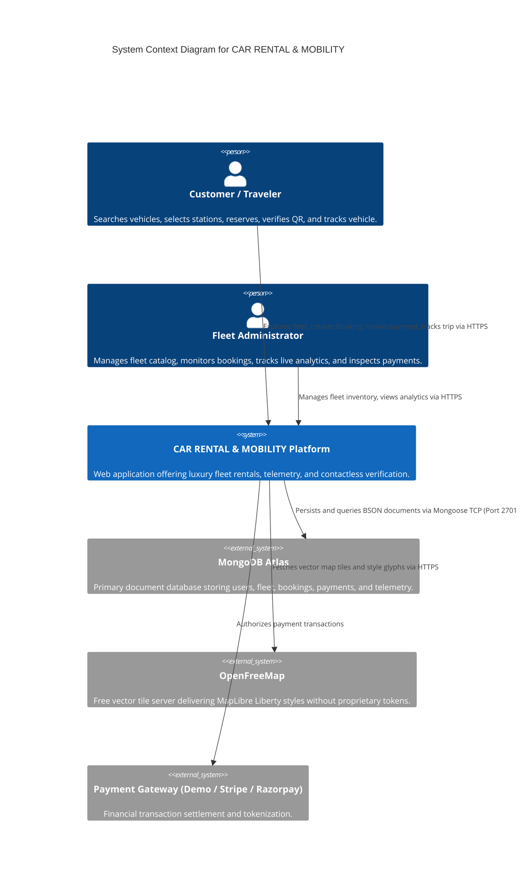
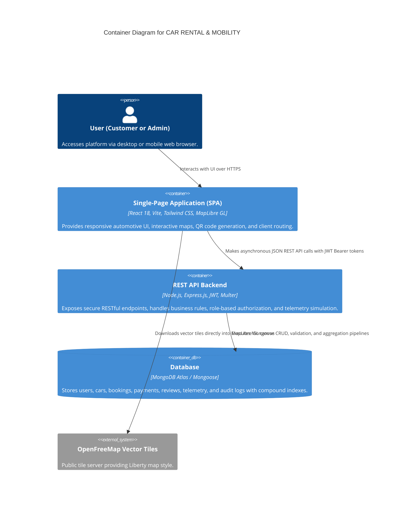
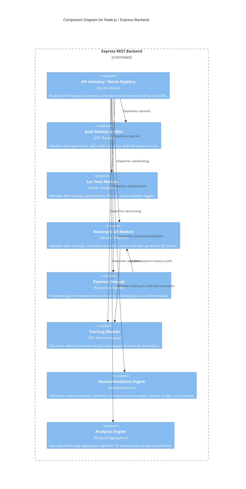

# C4 Architecture Specification
## Project: CAR RENTAL & MOBILITY

This document outlines the software architecture of **CAR RENTAL & MOBILITY** using the C4 model (Context, Containers, Components, and Code/Deployment).

---

### Level 1: System Context Diagram

The System Context diagram illustrates the system boundaries, users (Customer, Admin), and external dependencies (MongoDB Atlas, OpenFreeMap, Payment Gateways).

---

### Level 2: Container Diagram

The Container diagram zooms into the **CAR RENTAL & MOBILITY** platform, highlighting the high-level executable units: React Single Page Application, Node.js/Express REST API, and MongoDB Database.

---

### Level 3: Component Diagram (Backend API Modularity)

The Component diagram reveals the internal modular service boundaries of the Node.js Express Backend. Each module is structured following Domain-Driven Design (CO5 Microservices Readiness).

---

### Microservices Evolution Roadmap (CO5)

In future distributed deployments, each domain component above can be extracted into an independent microservice container:
1. **Auth Service**: Manages OAuth2/JWT issuance with its own Redis session store.
2. **Fleet Service**: Handles inventory, pricing, and media uploads with S3/Cloudinary storage.
3. **Reservation & Dispatch Service**: Manages booking state machines, date conflict locks, and cryptographic QR signing.
4. **Settlement Service**: Integrates with live Stripe/Razorpay webhooks.
5. **IoT Telemetry Service**: Receives real vehicle OBD-II/GPS MQTT broker pings.
6. **Recommendation Engine**: Python/Node ML service running cosine similarity or collaborative filtering.
