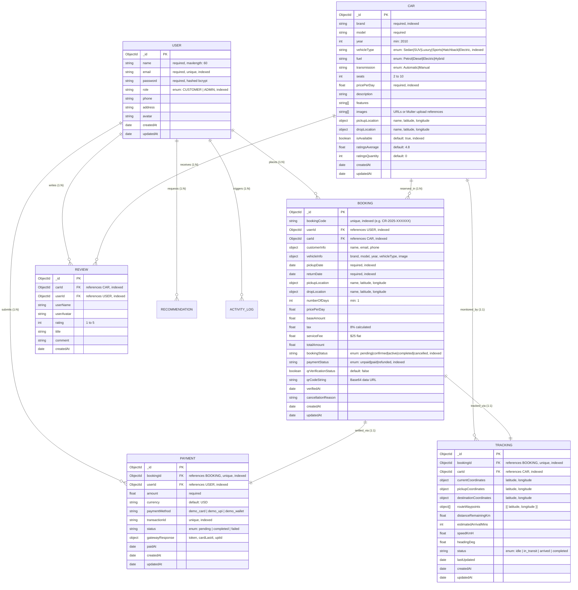

# Database Engineering & ER Diagram (CO1 / CO2)
## Project: CAR RENTAL & MOBILITY

This document presents the Entity-Relationship (ER) model, schema design, constraints, and compound indexes implemented in MongoDB Atlas for the **CAR RENTAL & MOBILITY** platform.

---

### Entity-Relationship (ER) Diagram



---

### Index Design Strategy

1. **Conflict Avoidance Index**:
   ```javascript
   bookingSchema.index({ carId: 1, pickupDate: 1, returnDate: 1, bookingStatus: 1 });
   ```
   *Rationale*: Eliminates overlapping vehicle reservations by enabling $lte / $gte range index scans.

2. **Catalog Filtering Compound Index**:
   ```javascript
   carSchema.index({ isAvailable: 1, vehicleType: 1, pricePerDay: 1 });
   ```
   *Rationale*: Accelerates queries filtering available vehicles by category and budget.

3. **Unique Keys**:
   - `users.email` (Unique index)
   - `bookings.bookingCode` (Unique index)
   - `payments.transactionId` (Unique index)
   - `tracking.bookingId` (Unique 1:1 mapping)
